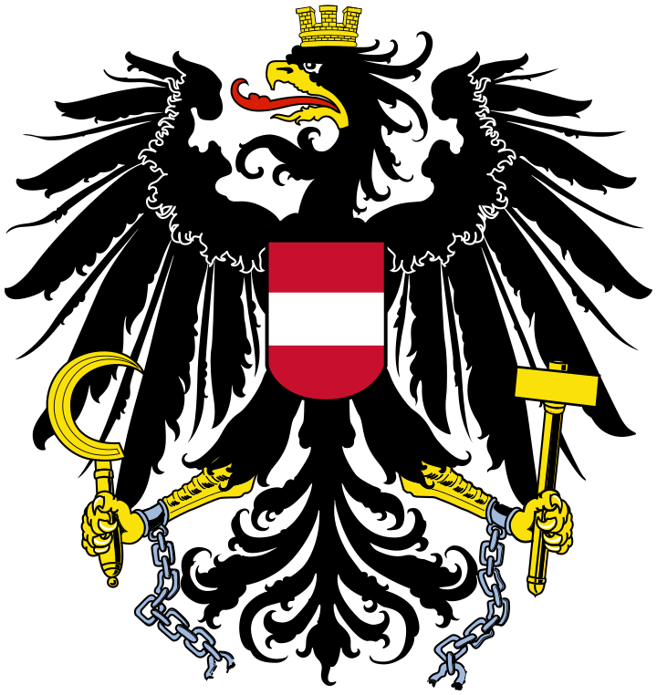
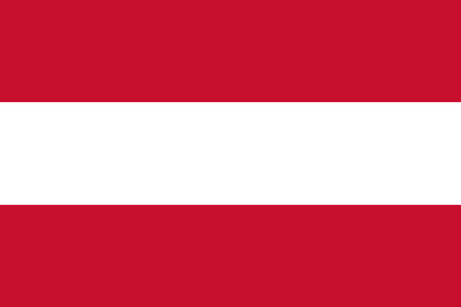

# Austria (Österreich)

## International Names

[name-en::Austria] 
[name-de::Österreich] 

[ISO2::AT] 
[ISO3::AUT] 

#has_/url_for_/code_repository :: https://github.com/SpocWiki/Europe-Austria 

This Repository/Folder/Wiki/Vault contains freely usable Text and Data 
covering the European country of [Austria](https://en.wikipedia.org/wiki/Austria). 

This Repository is intended to be shared as a common basis, 
by including it as a Sub-Repository in local File-Systems, 
specifically as part of the [\_Standards](https://github.com/SpocWiki/_Standards) Repository. 

Check out this Repository into this Subfolder: 
\_Standards/geo/Continent/Europe/Europe~Central/Austria 

> Caution: this is a very deep folder Structure with up to 170 Characters! 
> Make sure to check it out into a shallow Location on Windows! 
> 
> If you see an opportunity to reduce this Depth, create an Issue and discuss first, 
> because Changes may break Links or at least require every User 
> to update their local Repos! 
> 
> Constraints to consider when refactoring: 
> - Every Folder Name should be unique, also the grouping-Folders, so you can link to it without specifying the relative Path 
> - all Link-Paths should be relative. Wiki-Links are possible, but only when the Target-Folders or Files have unique Names. 
> - Between each Level and its Sub-Levels there should be a grouping Folder, to allow adding other Lists. 
>   - e.g. a City's boroughs should NOT be directly in the City Folder, but in a Sub-Folder named `City~boroughs` 

## Maps and Flags 

## #has_/image_for_/coat_of_arms 

#has_/image_for_/coat_of_arms :: ![[./Coat_of_arms_of_Austria.svg|150]]  


#has_/sound_of_/anthem :: ![[Anthem-Austria.mp3]]

## #has_/image_for_/flag 

#has_/image_for_/flag :: ![[./Flag_of_Austria.svg|200]]  

## #has_/map  


```leaflet
id: Austria
zoomFeatures: true 
minZoom: 2 
maxZoom: 18
geojsonFolder: .//
markerFolder: .///
```


[	ISO4217-currency_alphabetic	 :: EUR ] 
[	ISO4217-currency_name	 :: Euro ] 
[	ISO4217-currency_numeric	 :: 978 ] 
[	ISO4217-currency_minor_unit	 :: 2 ] 
[	ISO4217-currency_country_name	 :: AUSTRIA ] 

[	Telephone	 :: 43 ] 

[	Global	 :: True ] 
[	Global_Name	 :: World ] 

[	name	 :: Austria ] 
[	name-en	 :: Austria ] 
[	name-es	 :: Austria ] 
[	name-fr	 :: Autriche ] 
[	name-cn	 :: 奥地利 ] 
[	name-ar	 :: النمسا ] 
[	name-ru	 :: Австрия ] 

[	CLDR_display_name	 :: Austria ] 

[	UNTERM_English	 :: Austria ] 
[	UNTERM_English_Formal	 :: the Republic of Austria ] 
[	UNTERM_Spanish_Formal	 :: la República de Austria ] 
[	UNTERM_Spanish	 :: Austria ] 
[	UNTERM_French	 :: Autriche (l') [fém.] ] 
[	UNTERM_Arabic	 :: النمسا ] 
[	UNTERM_Arabic_Formal	 :: جمهورية النمسا ] 
[	UNTERM_Chinese	 :: 奥地利 ] 
[	UNTERM_Chinese_Formal	 :: 奥地利共和国 ] 
[	UNTERM_French_Formal	 :: la République d'Autriche ] 
[	UNTERM_Russian	 :: Австрия ] 
[	UNTERM_Russian_Formal	 :: Австрийская Республика ] 

Region_Name ::  [[Europe]] 
Intermediate_Region_Name ::  [[]] 
Sub-region_Name ::  [[Western Europe]] 

[	Region	 :: 150 ] 
[	Intermediate_Region	 ::  ] 
[	Sub-region	 :: 155 ] 

[	Geoname-ID	 :: 2782113 ] 
[	FIPS	 :: AU ] 
[	FIFA	 :: AUT ] 
[	IOC	 :: AUT ] 
[	MARC	 :: au ] 
[	GAUL	 :: 18 ] 
[	WMO	 :: OS ] 
[	ITU	 :: AUT ] 
[	DS	 :: A ] 
[	TLD	 :: .at ] 
[	EDGAR	 :: C4 ] 
[	M49	 :: 40 ] 

[	is_independent	 :: Yes ] 
[	Developed_/Developing_Countries	 :: Developed ] 
[	Land_Locked_Developing_Countries	 ::  ] 
[	Least_Developed_Countries	 ::  ] 
[	Small_Island_Developing_States	 ::  ] 

[	ISO3166-1-numeric	 :: 040 ] 


[Area-Total::8273] 
[Area-Land::82730] 
has_place_continent:: [[Europe]]  
[VehicleCode::A] 
Capital :: [[State/State~Wien/Wien-city]]  


[Alcohol-l::13.2] 
[Language-Id::497] 
#is_a_/Place  
#is_a_ :: [[Place]] 
[has_place_longitude::14.381]
[has_place_latitude::47.712]


## Confidential Links & Embeds: 
- [[../../../../../_Standards/geo/Continent/Europe/Europe~Central/Austria|Austria]] 
- [[../../../../../_public/geo/Continent/Europe/Europe~Central/Austria.public|Austria.public]] 
- [[../../../../../_internal/geo/Continent/Europe/Europe~Central/Austria.internal|Austria.internal]] 
- [[../../../../../_protect/geo/Continent/Europe/Europe~Central/Austria.protect|Austria.protect]] 
- [[../../../../../_private/geo/Continent/Europe/Europe~Central/Austria.private|Austria.private]] 
- [[../../../../../_personal/geo/Continent/Europe/Europe~Central/Austria.personal|Austria.personal]] 
- [[../../../../../_secret/geo/Continent/Europe/Europe~Central/Austria.secret|Austria.secret]] 
